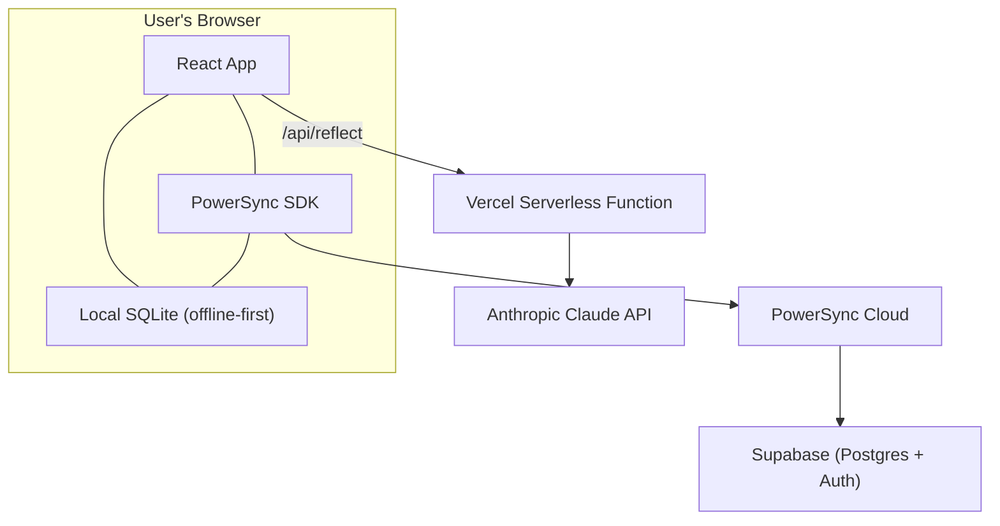
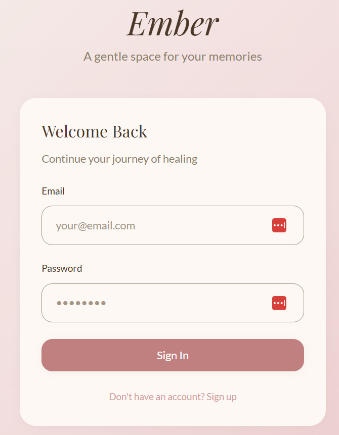
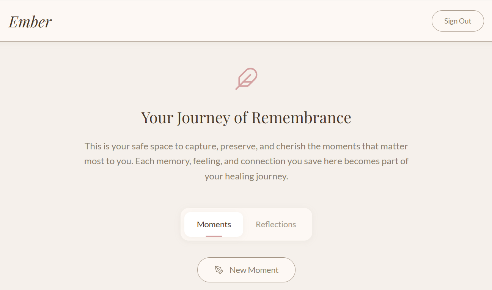
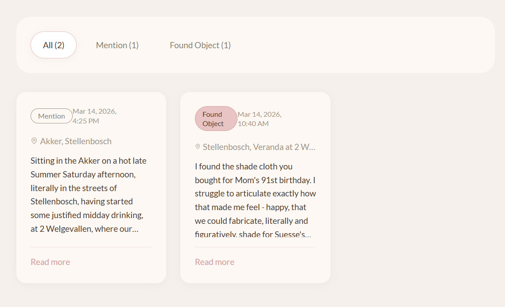
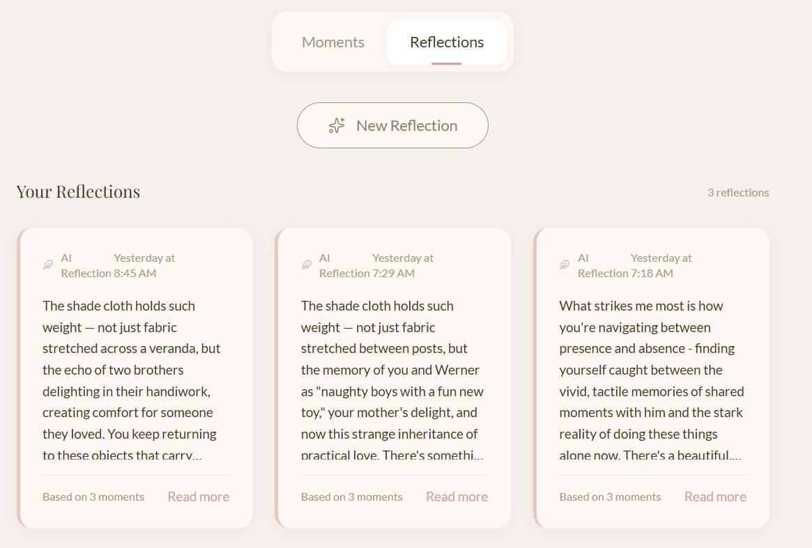
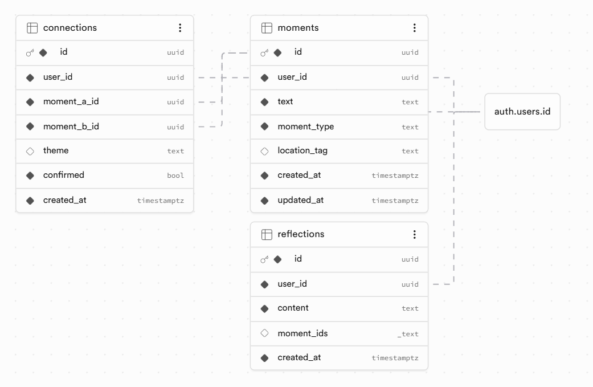

# 🕊️ Ember — A Grief Memory Companion

**A gentle, private space to capture the moments that keep someone alive after they're gone.**

🔗 **Live app:** [ember-seven-rho.vercel.app](https://ember-seven-rho.vercel.app)

---

## Why Ember Exists

Ember exists because the people we lose don't disappear.

My brother Berni took his own life last year. In the months that followed,  grief didn't always arrive in big dramatic anticipated ways - more often it showed up in unexpected, small, often blind-siding moments. Finding the shade cloth he helped hang on Mom's 91st birthday. The date on a till slip - the day before life changed. A bird of prey on a fence post. A balcony that's 4 stories high ...

These moments are fleeting. They surface in the middle of the seemingly ordinary, in rush hour traffic, mid happy-thought, on the brink of falling asleep. I wanted a place to catch and save them - not a journal with blank pages staring back at me and not a social media post, waiting for likes and comments and validation that can't sooth the pain. Something private, gentle, meaning-making and mine.

Ember is that. You capture a moment - a memory, a mention, a found object, a dream, a feeling - and over time, AI helps you notice the threads connecting them. Not therapy. Not advice. Rather a place of meaning and reflection, so you can feel a little less overcome and undone, less alone when grief visits and you remember -

---

## What It Does

**Capture moments** as they happen - categorised by type (memory, mention, found object, dream, feeling), with optional location and date. Moments are displayed as cards you can browse, filter, expand, edit, and delete.

**AI reflections** powered by Claude, weave connections across your moments - noticing patterns, naming tensions, and reflecting back details that make your grief yours. Each reflection is editable; you can correct the small things AI gets wrong while keeping the insights that resonate.

**Offline-first architecture** means the app works without an internet connection. Moments are stored locally in SQLite and synced to the cloud when connectivity returns - because grief doesn't wait for Wi-Fi.

---

## How PowerSync Powers Ember

Ember is built on PowerSync's local-first sync architecture, and it's central to how the app works.

**Why local-first matters for a grief app:** Moments of remembrance are deeply personal and often arrive in inconvenient places - a cemetery with no signal, a quiet room where you don't want to wait for a spinner. Ember uses PowerSync's local SQLite database so every interaction is instant and every moment is captured, regardless of connectivity.

**Sync Streams:** Ember uses PowerSync's Sync Streams (edition 3) with `auto_subscribe: true` to sync three tables - `moments`, `reflections`, and `connections` - all scoped to the authenticated user via `auth.user_id()`. This means data syncs automatically without manual subscription management, and each user only ever sees their own private memories.

**PowerSync + Supabase integration:** PowerSync sits between the local SQLite database and Supabase Postgres, handling bidirectional sync. Supabase provides authentication (email/password) and the source-of-truth database, while PowerSync ensures the local experience is fast, reliable, and offline-capable.

---

## Tech Stack

| Layer | Technology |
|-------|-----------|
| Frontend | React + TypeScript + Vite + Tailwind CSS v3 |
| Local database | SQLite via PowerSync SDK (@powersync/web) |
| Sync engine | PowerSync Cloud (Sync Streams, EU) |
| Backend database | Supabase (Postgres + Auth, West EU) |
| AI reflections | Anthropic Claude API (via Vercel Serverless Function) |
| Hosting | Vercel |

---

## Architecture




---

## Screenshots





---

## Running Locally

### Prerequisites
- Node.js 18+
- npm
- A Supabase project with the schema below
- A PowerSync Cloud instance connected to Supabase
- An Anthropic API key

### Setup

```bash
# Clone the repo
git clone https://github.com/mdecafmeyer/Ember.git
cd Ember

# Install dependencies
npm install

# Create environment file
cp .env.example .env.local
# Then edit .env.local with your credentials:
# VITE_SUPABASE_URL=your-supabase-url
# VITE_SUPABASE_ANON_KEY=your-supabase-anon-key
# VITE_POWERSYNC_URL=your-powersync-url
# ANTHROPIC_API_KEY=your-anthropic-api-key

# Run the dev server
npm run dev
```

The app runs at `http://localhost:5173`. The AI reflection endpoint is handled by the Vercel serverless function in `api/reflect.js` — when running locally with `vercel dev`, this works automatically.

### Database Schema



---

## Design Philosophy

Ember is designed to feel like a personal leather journal, not a productivity app. The interface uses warm, muted tones - dusty rose, warm taupe, and cream - with Playfair Display headings and soft shadows. Every design decision asks: *does this feel gentle enough for someone who is grieving?*

---

## Future Vision
Research suggests that up to 135 people are affected to some degree by every person lost to suicide, and between 15 and 30 people are severely affected by each death. While these numbers come from suicide bereavement research, the ripple of any loss - sudden or slow, expected or not - reaches further than we tend to acknowledge, A single death reshapes dozens of lives.

Ember is currently a private, single-user experience. But grief isn't carried alone. The next step is **shared spaces** - inviting family, friends, and others who are living in the wake of the same loss into a shared Ember space. Each one captures their own moments, in their own time, from their own perspective. The AI then weaves threads across the whole tapestry of memories:
*"Your sister also remembered him at the oak trees..."*

Beyond shared spaces, the future of Ember includes:

- **Photo and voice memo capture** - because some moments are better shown or spoken than typed
- **Timeline view** — moments arranged chronologically on a visual timeline, showing how grief and remembrance evolve over time
- **A map of remembrance** - moments plotted by location, showing the geography of your grief and connection
- **Date awareness** - birthdays, anniversaries and other meaningful dates, with a gentle prompt to capture how the day felt
- **A printable journal** - a beautiful PDF of all your moments and reflections, something physical to hold

---

## Built By

**Margarethe de Cafmeyer** - solo entry, built with Cursor and Claude. This is my first app, built from personal need. Ember exists because grief deserves a gentle, private space - and because the people we lose deserve to be remembered in all the small, searing, beautiful ways they show up.
